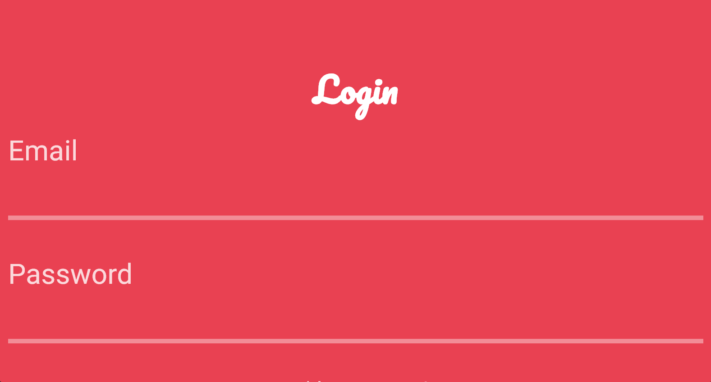
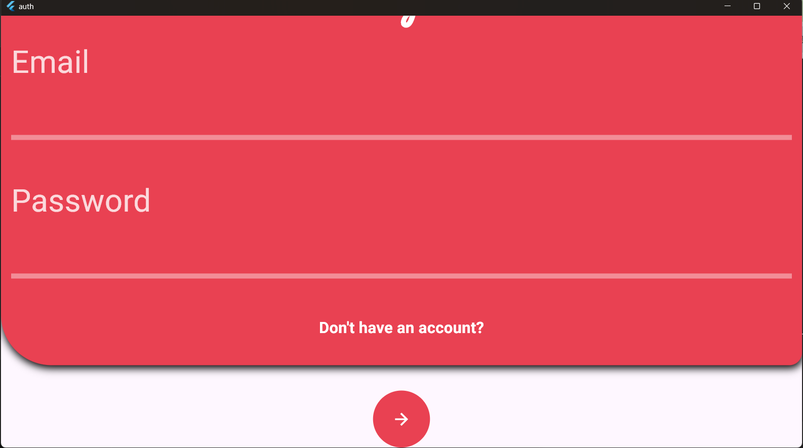
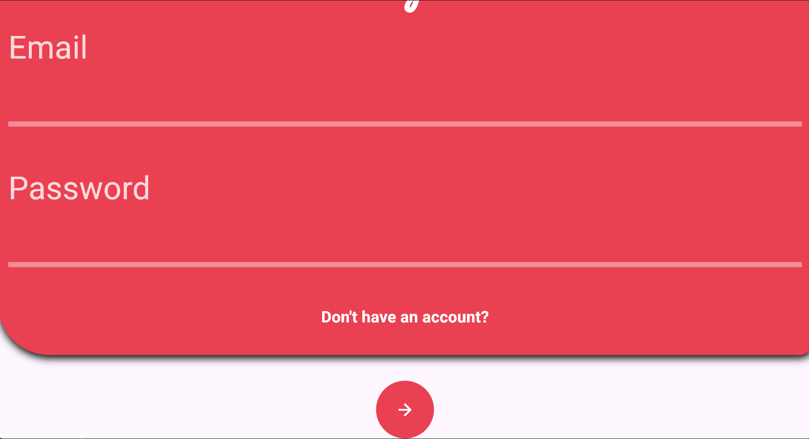

# CredLogix


---

## 🔐 About

**CredLogix** is a full-stack Login and Registration system built using **Flutter (Windows Desktop)** for frontend and **Spring Boot + MySQL** for backend. It supports user registration, login, and secure credential management using REST APIs.

---

## 💡 Features

- 🔒 User Registration with Form Validation
- 🔑 User Login with Session/Token Support
- 🧠 Password Encryption with BCrypt
- 💾 MySQL Integration for Persistent Storage
- 🔗 Seamless Flutter-to-SpringBoot REST Integration

---

## 🛠️ Technologies Used

- [Flutter](https://flutter.dev/) (Desktop)
- [Spring Boot](https://spring.io/projects/spring-boot)
- [MySQL](https://www.mysql.com/)
- [RESTful APIs](https://restfulapi.net/)
- Java, Dart, Maven, Hibernate (JPA)

---
## 🖼️ Demo

<p float="left">
  
  
  
</p>


## 🚀 How to Run the Project

### 1️⃣ Backend - Spring Boot (Java)

```bash
# Navigate to the backend directory
cd api

# Start the Spring Boot server
mvn spring-boot:run
